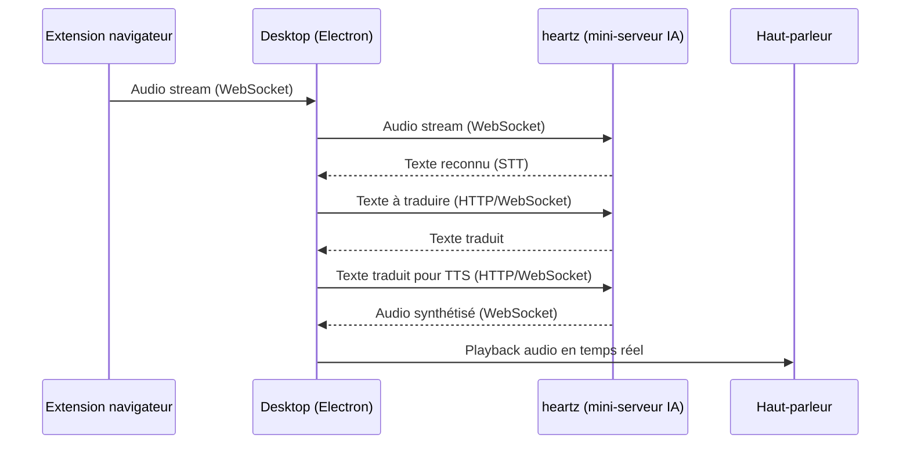

# LiveTrad

LiveTrad est une solution de traduction audio en temps réel pour les réunions en ligne, permettant une communication fluide et naturelle entre participants de langues différentes.

## Fonctionnement

### Architecture Technique

### Flux Utilisateur

1. L'extension navigateur capture l'audio de la réunion
2. L'audio est transmis en temps réel au desktop via WebSocket
3. Le desktop orchestre le pipeline de traitement IA via heartz
4. Le résultat audio traduit est joué à l'utilisateur

## Composants

### Extension
- Capture audio depuis les réunions en ligne
- Transmission en temps réel vers le desktop
- Interface utilisateur minimaliste

### Desktop (Electron)
- Application locale pour l'orchestration
- Communication avec les modules IA
- Gestion du playback audio

### heartz
- Mini-serveur IA (FastAPI)
- Modules STT (Speech-to-Text)
- Modules de traduction
- Modules TTS (Text-to-Speech)

## Évolutions Prévues

### Version 1.0 - Traduction Simple
- Traduction audio unidirectionnelle
- Voix standard
- Performance optimisée

### Version 2.0 - Voix Améliorées
- Détection automatique du genre
- Voix naturelles adaptées
- Cohérence vocale

### Version 3.0 - Communication Bidirectionnelle
- Traduction dans les deux sens
- Préservation des caractéristiques vocales
- Communication naturelle

## Configuration Requise

### Utilisateur
- Navigateur moderne (Chrome, Firefox, Edge)
- Connexion internet stable
- Application desktop LiveTrad

### Technique
- Traitement IA déporté sur serveur
- Extension légère et optimisée
- Communication WebSocket pour le temps réel

## Cas d'Usage

### Entreprises
- Réunions internationales
- Collaboration d'équipes mondiales
- Formations et webinaires multilingues

### Éducation
- Classes internationales
- Apprentissage des langues
- Conférences académiques

### Personnel
- Appels familiaux internationaux
- Pratique des langues
- Échanges culturels

## Sécurité

- Chiffrement de bout en bout
- Aucun enregistrement conservé
- Conformité RGPD
- Protection des données personnelles

## Support

- Documentation technique
- Support utilisateur
- Guides d'installation
- FAQ

## Licence

Ce projet est sous licence MIT - voir le fichier [LICENSE.md](LICENSE.md) pour plus de détails.
